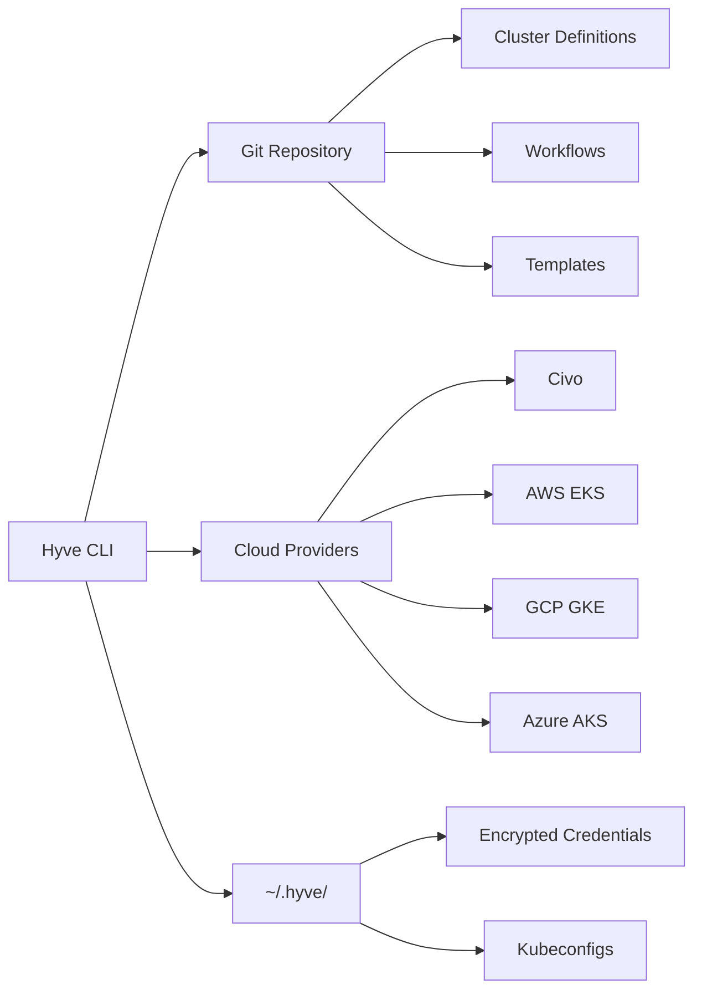

<p align="center">
  
</p>

## What is Hyve?

Hyve is a **GitOps-first** Kubernetes cluster management CLI supporting **Civo, AWS (EKS), GCP (GKE), and Azure (AKS)**. Manage your entire infrastructure through Git repositories with automated workflows, secure credential management, and reusable templates.

<CardGroup cols={3}>
  <Card title="Git-Native" icon="git" color="#f97316">
    All cluster state lives in Git. Every change is tracked, versioned, and auditable.
  </Card>

  <Card title="Multi-Repository" icon="folder-tree" color="#0ea5e9">
    Separate repos for dev/staging/prod with isolated credentials and configurations.
  </Card>

  <Card title="Automated Workflows" icon="gears" color="#8b5cf6">
    Define deployment pipelines with requirements validation and variable substitution.
  </Card>
</CardGroup>

## Quick Start

Get up and running in under 5 minutes:

<Steps>
  <Step title="Install Hyve">
    ```bash
    git clone <repository-url>
    cd hyve
    go build -o hyve .
    ```
  </Step>

  <Step title="Configure API Token">
    ```bash
    ./hyve config set-token civo
    # Enter your Civo API token when prompted
    ```
  </Step>

  <Step title="Add Git Repository">
    ```bash
    ./hyve git add production \
      --repo-url https://github.com/company/hyve-state.git
    ```
  </Step>

  <Step title="Create Your First Cluster">
    ```bash
    ./hyve cluster add my-cluster \
      --provider civo \
      --region PHX1 \
      --nodes g4s.kube.medium
    ```
  </Step>
</Steps>

<Card title="🎉 You're Ready!" icon="rocket" href="/quickstart" color="#3b82f6">
  Head to the full Quick Start guide to learn more about workflows and templates.
</Card>

## Why Choose Hyve?

<AccordionGroup>
  <Accordion title="🔒 Security First" icon="shield">
    - AES-GCM encrypted credential storage
    - Isolated kubeconfigs per repository
    - Portable encryption keys
    - No secrets in Git history
  </Accordion>

  <Accordion title="📦 Multi-Environment Ready" icon="layer-group">
    - Separate repositories for each environment
    - Environment-specific credentials
    - Isolated state management
    - Easy promotion workflows
  </Accordion>

  <Accordion title="🤖 Workflow Automation" icon="robot">
    - Tool version validation
    - Secret requirements checking
    - Environment variable substitution
    - Multi-job execution
  </Accordion>

  <Accordion title="🎯 Reusable Templates" icon="copy">
    - Cluster patterns with workflows
    - One-command cluster creation
    - Standardized configurations
    - Automated post-deployment tasks
  </Accordion>
</AccordionGroup>

## Key Features

<CardGroup cols={2}>
  <Card title="GitOps Workflow" icon="code-branch" href="/concepts/gitops" color="#8b5cf6">
    All cluster state managed through Git repositories with automatic reconciliation
  </Card>

  <Card title="Cluster Management" icon="server" href="/guides/cluster-management" color="#3b82f6">
    Create, modify, and delete Kubernetes clusters declaratively
  </Card>

  <Card title="Automated Workflows" icon="diagram-project" href="/workflows/overview" color="#22c55e">
    Define and execute deployment pipelines with validation
  </Card>

  <Card title="Cluster Templates" icon="stamp" href="/guides/template-management" color="#06b6d4">
    Reusable cluster configurations with automated workflows
  </Card>

  <Card title="Secure Credentials" icon="key" href="/guides/credentials" color="#f43f5e">
    Encrypted storage for API tokens and kubeconfigs
  </Card>

  <Card title="Variable Substitution" icon="code" href="/workflows/variables" color="#6366f1">
    Full shell support with workflow and environment variables
  </Card>
</CardGroup>

## Popular Use Cases

<Tabs>
  <Tab title="Multi-Environment">
    Manage separate Git repositories for development, staging, and production:

    ```bash
    # Production environment
    hyve git add production --repo-url https://github.com/company/hyve-prod.git
    hyve cluster add prod-api --provider civo --region NYC1 --nodes g4s.kube.large

    # Development environment
    hyve git add development --repo-url https://github.com/company/hyve-dev.git
    hyve git use development
    hyve cluster add dev-api --provider civo --region PHX1 --nodes g4s.kube.small
    ```
  </Tab>

  <Tab title="Automated Deployments">
    Create workflows that validate requirements and deploy applications:

    ```yaml
    apiVersion: v1
    kind: Workflow
    metadata:
      name: deploy-app
    spec:
      requirements:
        tools:
          - name: kubectl
            version: "1.28"
        secrets:
          - name: DOCKER_TOKEN
            provider: docker
      jobs:
        - name: deploy
          steps:
            - name: apply
              command: kubectl apply -f manifests/
    ```
  </Tab>

  <Tab title="Template-Based">
    Define cluster templates for consistent deployments:

    ```bash
    # Create template with lifecycle workflows
    hyve template create prod-template \
      --region NYC1 \
      --nodes g4s.kube.large,g4s.kube.large,g4s.kube.large \
      --on-created setup-monitoring,deploy-app \
      --on-destroy backup-data

    # Execute template
    hyve template execute prod-template prod-cluster-01
    ```
  </Tab>
</Tabs>

## Architecture



Hyve follows a declarative approach:
1. **Define** clusters as YAML files in Git repositories
2. **Commit** changes to version control
3. **Reconcile** to apply changes to cloud infrastructure
4. **Automate** with workflows and templates

## Storage

All Hyve data is stored securely in `~/.hyve/`:

```
~/.hyve/
├── credentials.db       # AES-GCM encrypted credentials
├── kubeconfigs.db      # Encrypted cluster kubeconfigs
├── repositories.db     # Repository configurations
├── config.yaml         # User preferences
└── repositories/       # Cloned repository storage
    ├── production/
    │   ├── clusters/   # Cluster YAML files
    │   ├── workflows/  # Workflow definitions
    │   └── templates/  # Cluster templates
    └── development/
```

## Next Steps

<CardGroup cols={3}>
  <Card title="Quick Start" icon="rocket" href="/quickstart" color="#3b82f6">
    Complete walkthrough with examples
  </Card>

  <Card title="Installation" icon="download" href="/installation" color="#3b82f6">
    Detailed installation guide
  </Card>

  <Card title="Configuration" icon="sliders" href="/configuration" color="#f97316">
    Set up API tokens and credentials
  </Card>

  <Card title="Core Concepts" icon="book" href="/concepts/gitops" color="#6366f1">
    Understand GitOps principles
  </Card>

  <Card title="CLI Reference" icon="terminal" href="/cli/overview" color="#10b981">
    Complete command documentation
  </Card>

  <Card title="Workflow Guide" icon="diagram-project" href="/workflows/overview" color="#22c55e">
    Learn workflow automation
  </Card>
</CardGroup>

---

<Note>
  **Ready to get started?** Follow the [Quick Start guide](/quickstart) to create your first cluster in minutes.
</Note>
